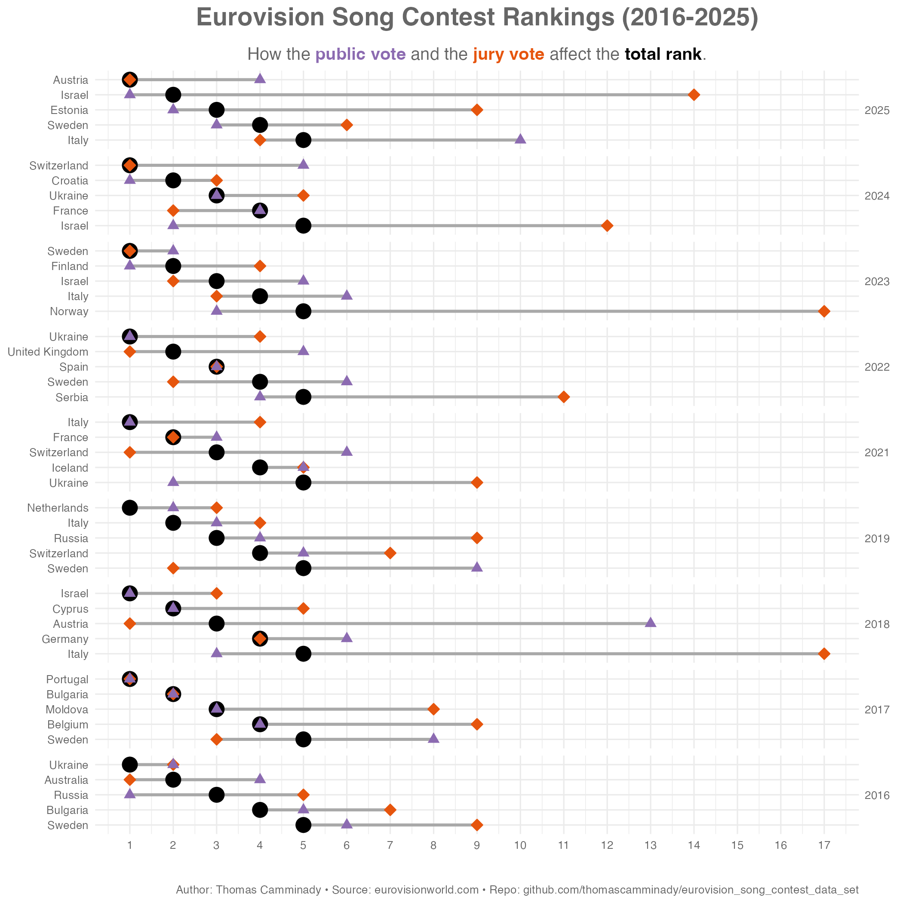

# eurovision_song_contest_data_set

## Info

Find this repository on [Github](https://github.com/thomascamminady/eurovision_song_contest_data_set) or check out the [documentation](https://thomascamminady.github.io/eurovision_song_contest_data_set).

## Development

Set up the full project by running `make`.

## Documentation

Go to `Settings->Pages` and set `Source` (under `Build and deployment`) to `Github Actions`.

## Credits

This package was created with [`cookiecutter`](https://github.com/audreyr/cookiecutter) and [`thomascamminady/cookiecutter-pypackage`](https://github.com/thomascamminady/cookiecutter-pypackage), a fork of [`audreyr/cookiecutter-pypackage`](https://github.com/audreyr/cookiecutter-pypackage).
